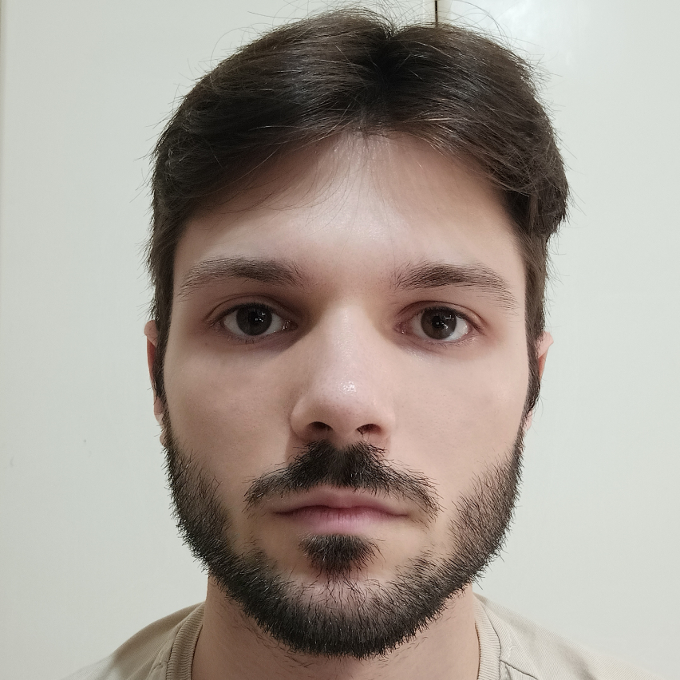
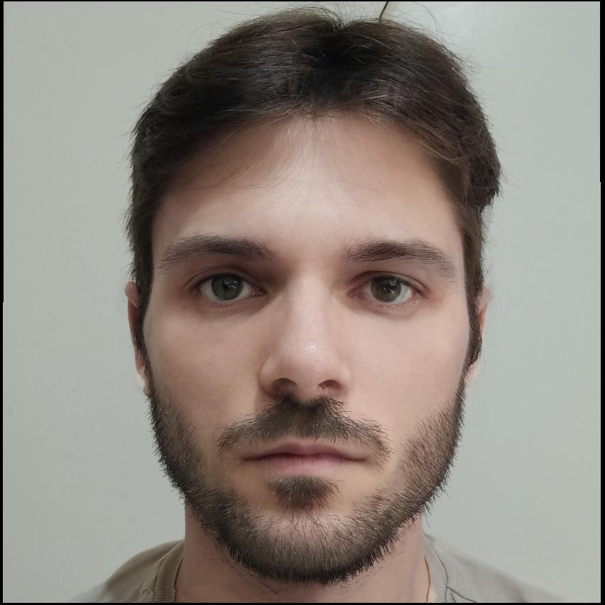
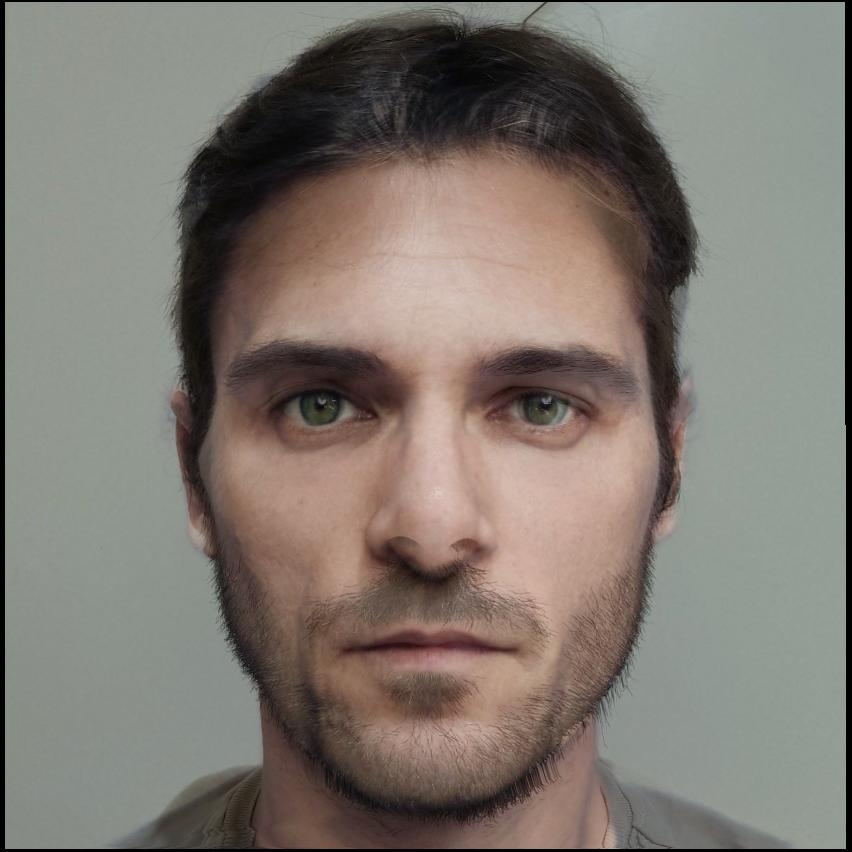
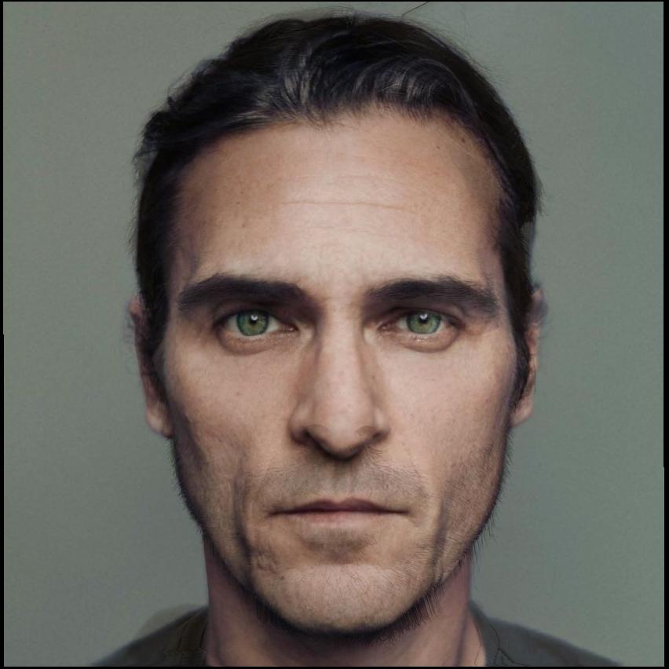
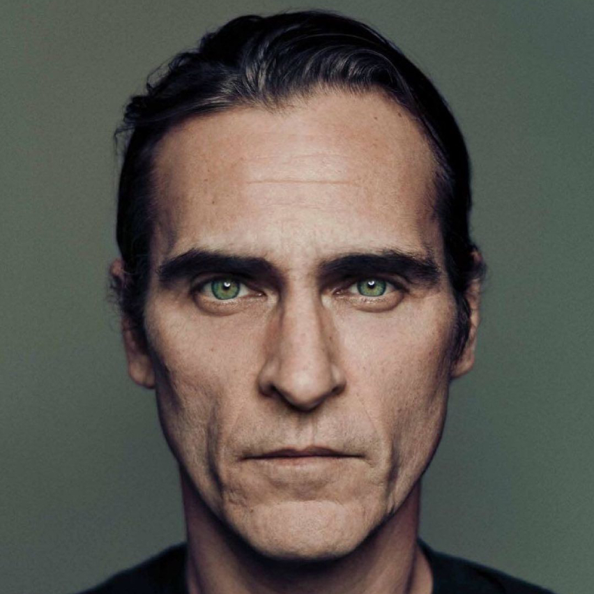

# Face Morphing Project
The code in this repository was written as the final project in my BSc's Image Processing class @UoA. 

The code creates a morphing sequence between two faces (pictures) whose facial features have been manually selected using the cpselect tool. By creating a Delaunay triangulation of the two faces and computing and applying an affine transformation to gradually warp the triangular mesh of the first face to the other, a morphing sequence (video) can be formed.

| Original Face | Quarter Face | Half Face | 3-Quarter Face | Final Face | 
|---------------|--------------|-----------|----------------|------------|
||||||

## Project Structure
<code><pre>.
|_images: original images, resulting morphing sequence and demonstrative frames.
|_points: facial features of the 2 pictures.
|_transformations: code relevant to the computation and application of an affine transformation on triangles.
|_create_sequence.m: script that creates the morphing sequence (may take a while to run.)
|_morph.m: function that creates a frame for the morphing sequence
</code></pre>
